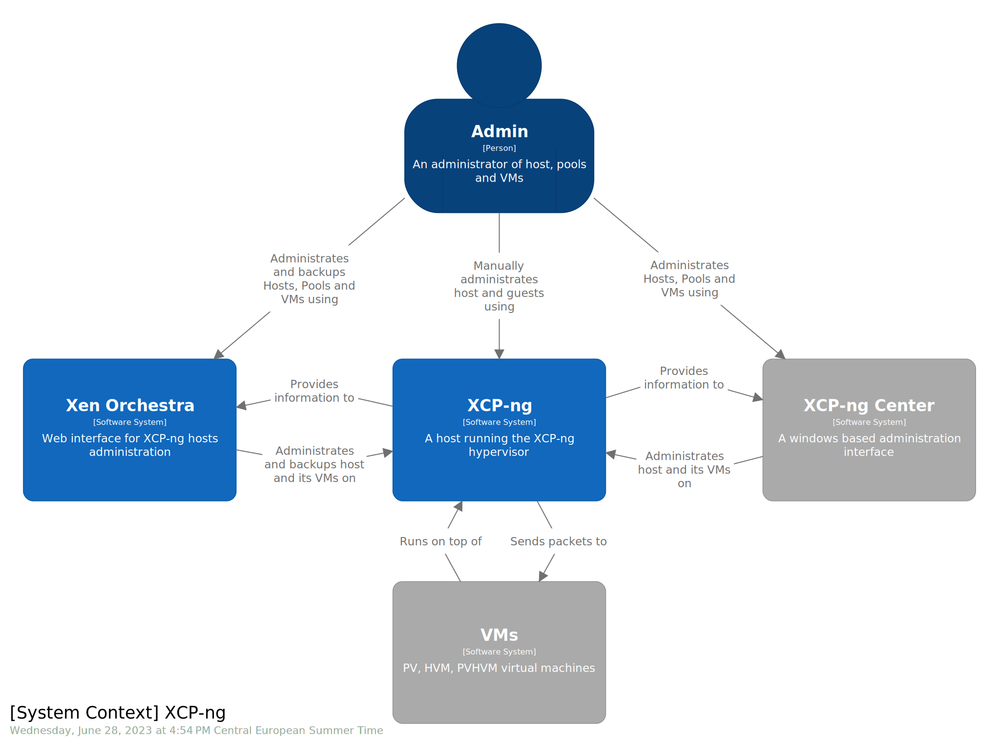
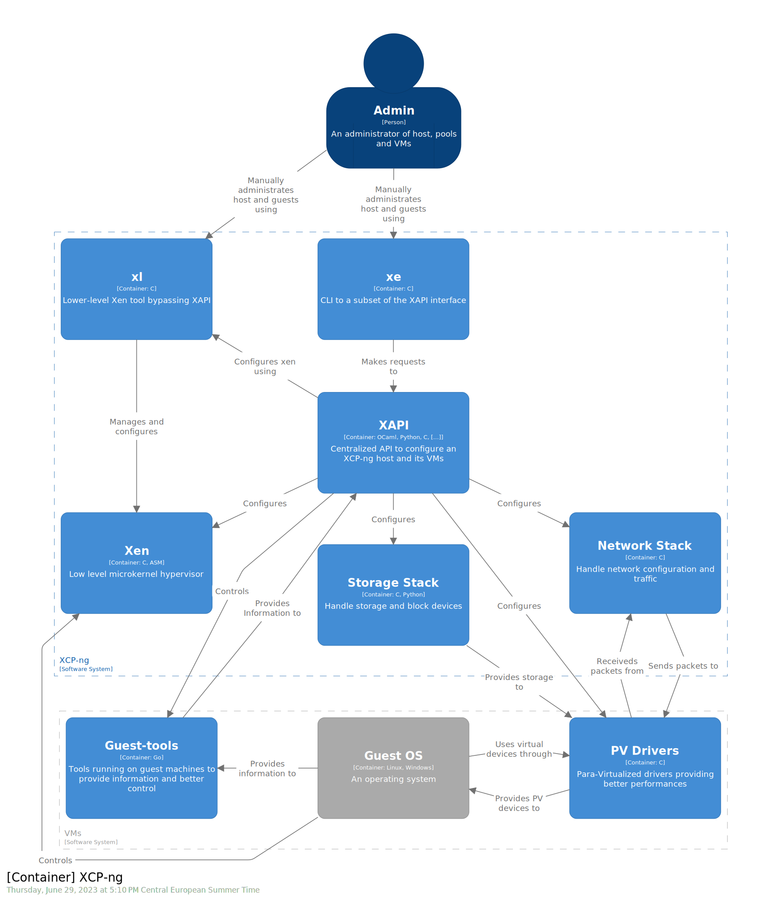
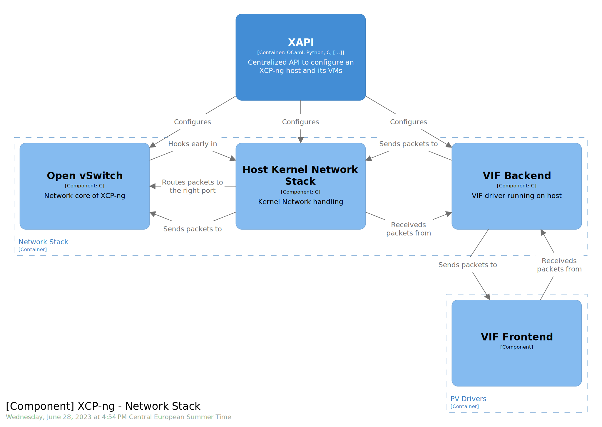

# c4-draft

A quick architecture draft overview of XCP-ng trying to follow the [c4
model](https://c4model.com/), done with  [structurizr lite](https://structurizr.com/share/76352/documentation). Aiming at creating a baseline architecture part to be added to the main documentation on [xcp-ng-org](https://github.com/xcp-ng/xcp-ng-org).

## Diagrams

## References

Pages, images and other documents I used as reference to get a better understanding.

- [Structurizr DSL cookbook](https://github.com/structurizr/dsl/tree/master/docs/cookbook)
- [Structurizr DSL language reference](https://github.com/structurizr/dsl/blob/master/docs/language-reference.md)
- [XCP-ng Architecture doc](https://xcp-ng.org/docs/architecture.html)
- [xenopsd-ng's README](https://github.com/xcp-ng/xenopsd-ng)
- [xapi Reference](https://xapi-project.github.io/xen-api/)
- [xenopsd architecture doc](https://github.com/xapi-project/xen-api/tree/master/ocaml/xenopsd/doc/architecture)
- [xapi-storage API doc](http://xapi-project.github.io/xapi-storage/#introduction)

## Tools

- [drawio](https://www.drawio.com/): I used the desktop app
- [structurizr](https://structurizr.com/): Made by Simon Brown, the guy behind
  the C4 model.
  - lite, on premises and CLI are open source
  - description language: allows better versionning, consistency between
    diagram as they use the same descriptions instead of recreating diagrams
    manually for each "level".
